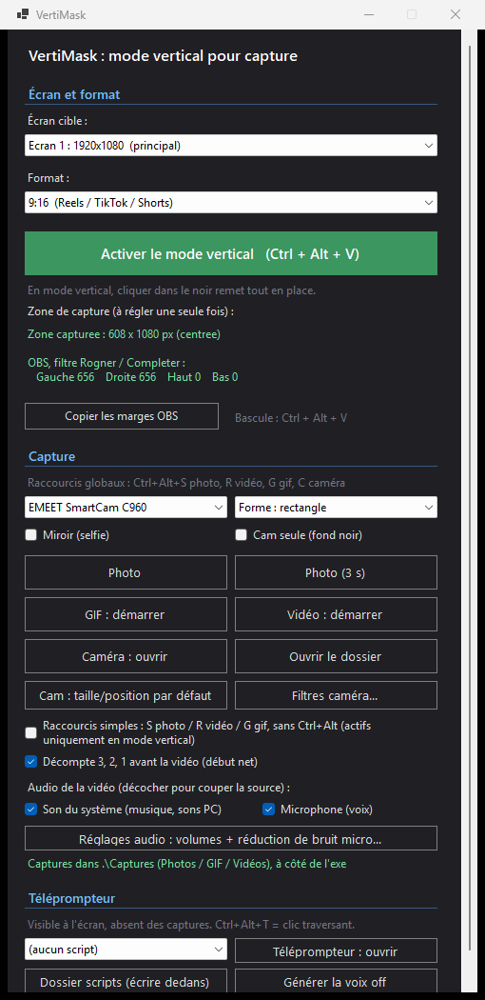

# VertiMask

Petit utilitaire Windows (C# / .NET 8 / WinForms) qui fait basculer un écran en **mode vertical pour la capture**, et qui sait aussi **filmer / screener lui-même** (photo, GIF, vidéo MP4 avec son), **sans dépendre d'OBS ou ShareX**.

Quand tu l'actives, **toutes les fenêtres de l'écran choisi se rangent dans un cadre vertical** (9:16 par défaut) au centre, et tout le reste devient noir. Le bouton croix (ou Ctrl+Alt+V) **remet tout exactement comme avant**. Les autres écrans ne sont pas touchés.

Ça me sert à produire du **Reels / TikTok / Shorts** : l'écran a déjà la bonne forme, et la capture intégrée enregistre directement la zone verticale (tu peux aussi continuer à utiliser OBS / ShareX si tu préfères, les marges sont fournies).

C'est un outil compagnon de [RoleplayOverlay](https://github.com/Gstarmix/RoleplayOverlay), pensé pour le même usage : produire de la vidéo verticale.

---

## L'outil en images

Tout tient dans un panneau unique : écran cible et format, activation du mode vertical, marges OBS, capture intégrée (photo / GIF / vidéo avec son), caméra avec filtres, et téléprompteur :



---

## Le principe, et sa limite physique

Un écran 1920x1080 ne fait que **1080 pixels de haut**. Une vidéo verticale fait 1080 de large par **1920 de haut** : elle ne rentre donc pas en hauteur sur un écran paysage. Impossible d'avoir un vrai 1080x1920 natif sans tourner physiquement le moniteur.

VertiMask travaille donc dans un **cadre 9:16 qui occupe toute la hauteur** (608x1080 sur un écran 1080p), centré, avec des bandes noires sur les côtés. Il déplace et redimensionne toutes les fenêtres ouvertes dans ce cadre. La capture (intégrée, ou OBS/ShareX) enregistre cette zone, puis la met à l'échelle en 1080x1920.

Note : il y a une légère perte de netteté à l'upscale (608 vers 1080 de large). Pour de la qualité native maximale, l'autre option reste de tourner physiquement l'écran en mode portrait dans Windows.

---

## Fonctionnalités

### Mode vertical
- Range les fenêtres **de l'écran ciblé** dans un cadre vertical **9:16 / 4:5 / 1:1** centré, et noircit les côtés.
- **Le cadre reste totalement libre** : tu cliques et navigues normalement dans tes apps (rien n'est posé par-dessus).
- **Masque la barre des tâches** pendant le mode (restaurée en sortie), pour une capture propre.
- **Restauration exacte** : chaque fenêtre retrouve sa position et sa taille d'origine en sortie.
- **Anti-débordement** : une appli qui passe en plein écran (Chrome F11, etc.) est **re-contrainte en continu** dans le cadre, et les fenêtres ouvertes pendant le mode sont rangées automatiquement.
- Choix de l'écran cible (gère plusieurs moniteurs, les autres ne sont pas touchés).
- Affiche les **marges exactes** pour le filtre Rogner / Compléter d'OBS, avec bouton Copier.
- Compatible DPI Per-Monitor v2 (écrans en 125 %, 150 %, etc.).

### Capture intégrée (sans OBS / ShareX, sans dépendance externe)
- **Photo** de la zone (PNG), avec option **minuterie 3 s**, copiée aussi dans le presse-papier.
- **GIF animé** de la zone.
- **Vidéo MP4 H.264** de la zone, avec **audio micro + son système** mixés (Media Foundation + WASAPI).
- Sorties horodatées dans un dossier **local `Captures`** à côté de l'exe (pas de OneDrive), rangées par type : **Photos / GIF / Videos**. Bouton **Ouvrir le dossier**.
- **Retour visuel clair** : flash type appareil photo, **toast** de confirmation cliquable (ouvre le dossier), et **badge REC** à l'écran pendant l'enregistrement (placé hors zone, donc absent du GIF / de la vidéo).
- Boutons sur le panneau **et** sur les bandes noires (utilisables pendant le mode).

### Mode caméra (webcam)
- **Fenêtre webcam flottante**, toujours au-dessus, **déplaçable** (clic-glisser partout) et **redimensionnable** par le coin avec **ratio verrouillé** (pas de déformation).
- **Choix de la caméra** si tu en as plusieurs (par nom), **y compris les caméras virtuelles** : `OBS Virtual Camera`, `Camera (NVIDIA Broadcast)`... (elles apparaissent dans la liste au même titre qu'une webcam). Pratique pour récupérer un flux déjà retravaillé (flou d'arrière-plan, recadrage auto, etc.). La source doit tourner (OBS ouvert avec « Démarrer la caméra virtuelle », ou NVIDIA Broadcast lancé) ; sinon VertiMask le signale au lieu d'afficher un cadre noir.
- **Formes** : rectangle, arrondi, **cercle** (pastille ronde façon Reels ; hors-forme, le fond passe au travers).
- **Miroir (selfie)** optionnel.
- **Cam seule (plein cadre)** : la caméra **remplit tout le cadre vertical** (recadrée, sans bandes noires), le bureau et la barre des tâches sont cachés. La vidéo est alors "toi en plein écran vertical", idéale pour du montage / des overlays (CapCut, etc.).
- **Croix rouge** flottante (hors cadre) pour fermer la caméra à tout moment, même quand elle couvre l'écran.
- Comme elle est posée dans le cadre, **elle est filmée automatiquement** par la photo / le GIF / la vidéo.

### Téléprompteur (lire face caméra)
- Une fenêtre **téléprompteur** affiche ton texte près de l'objectif et le fait **défiler tout seul**, pour que tu lises en **regardant la caméra** (effet "je parle à mon audience").
- **Invisible dans l'enregistrement** : la fenêtre est exclue des captures (`WDA_EXCLUDEFROMCAPTURE`), tu la vois à l'écran mais elle n'apparaît jamais dans la photo / le GIF / la vidéo.
- Tes textes vivent dans le dossier **`scripts` de RoleplayOverlay** (le hub de production / voix off), partagé avec le téléprompteur ; tu les choisis dans une liste (fichiers `.txt`). Une ligne entre `[crochets]` ou commençant par `#`/`>` = repère (affiché en petit) ; le reste = texte à dire (gros).
- Déplaçable, redimensionnable. Vitesse, taille de texte et **hauteur de la ligne de lecture** réglables (boutons Ligne haut / Ligne bas, pour caler la lecture selon la position de ta webcam). Raccourcis : Espace = lire/pause, flèches = défiler, Ctrl+flèches = monter/descendre la ligne, +/- = vitesse, A-/A+ = taille, Début = recommencer.
- **Conversion** : `convert-script.ps1 mon-script.md` transforme un script (même au format détaillé ACTION / ÉCRAN / PAROLE) en fichier téléprompteur prêt à lire (il ne garde que le texte à dire, accents conservés). `convert-script.ps1 -ShowPrompt` affiche un prompt à coller à une IA pour convertir n'importe quel texte.
- **Voix off** : le bouton **Générer la voix off** synthétise le script sélectionné en fichier audio (TTS), en déléguant à RoleplayOverlay (voix SAPI par défaut, Azure possible côté RoleplayOverlay).

### Raccourcis globaux
| Raccourci | Action |
|-----------|--------|
| `Ctrl + Alt + V` | Activer / quitter le mode vertical |
| `Ctrl + Alt + S` | Photo |
| `Ctrl + Alt + R` | Vidéo (démarrer / arrêter) |
| `Ctrl + Alt + G` | GIF (démarrer / arrêter) |
| `Ctrl + Alt + C` | Caméra (ouvrir / fermer) |

VertiMask **mémorise** tes choix (`vertimask.json` à côté de l'exe) : écran, format, caméra, forme, miroir, et les réglages du téléprompteur (script, vitesse, taille, hauteur de ligne).

---

## Limites connues

C'est l'approche "réorganisation de fenêtres" (résolution native conservée), donc :

- Une application dont la largeur minimale dépasse 608 px sera coupée par le noir sur la droite (elle est rangée une fois puis laissée telle quelle).
- Les jeux en plein écran exclusif ne se laissent pas déplacer.
- L'enregistrement vidéo capture l'écran (la zone) : ce qui est masqué ou hors zone n'apparaît pas.

Pour un résultat "tout se réorganise" plus radical, l'alternative est de basculer la **résolution de l'écran** en vertical, ou de **tourner physiquement** un écran en portrait.

---

## Installation

Prérequis : Windows 10/11 et le **.NET 8 Desktop Runtime** (ou le SDK).

```powershell
git clone https://github.com/Gstarmix/VertiMask.git
cd VertiMask
dotnet build -c Release
.\bin\Release\net8.0-windows\VertiMask.exe
```

Pour obtenir **un seul `VertiMask.exe` double-cliquable** à la racine du projet (pas besoin d'aller dans `bin`) :

```powershell
.\publish.ps1                 # exe unique (le .NET 8 Desktop Runtime doit etre installe)
.\publish.ps1 -SelfContained  # exe 100% autonome, sans runtime (~150 Mo)
```

L'exe est alors `C:\dev\VertiMask\VertiMask.exe` (ou le dossier où tu as cloné).

---

## Utilisation

1. Lancer VertiMask.
2. Choisir l'**écran** cible et le **format** (9:16 par défaut).
3. Cliquer sur **Activer le mode vertical** (ou Ctrl + Alt + V). Les fenêtres se rangent dans le cadre, le reste passe au noir.
4. (Optionnel) Ouvrir la **caméra**, choisir la forme (cercle pour une pastille), la placer dans le cadre.
5. **Capturer** : Photo / GIF / Vidéo depuis le panneau, les bandes, ou les raccourcis. Les fichiers arrivent dans `Images\VertiMask`.
6. Pour revenir : bouton croix ou Ctrl + Alt + V.

### Avec OBS / ShareX (optionnel)

La capture intégrée suffit pour la plupart des usages, mais tu peux toujours :

- **OBS** : Sources, +, Capture d'écran, choisir l'écran en mode vertical. Clic droit, Filtres, +, **Rogner / Compléter**, entrer les marges affichées par VertiMask (bouton **Copier les marges OBS**). Vidéo de sortie en **1080x1920**.
- **ShareX** : capturer une **région** correspondant au cadre (coordonnées indiquées par VertiMask).

### Avec NVIDIA Broadcast / OBS (caméra et micro assistés, optionnel)

VertiMask fonctionne seul, mais il sait aussi **se brancher sur des logiciels spécialisés** quand tu en as, plutôt que de tout réimplémenter lui-même :

- **Caméra** : sélectionne `Camera (NVIDIA Broadcast)` ou `OBS Virtual Camera` dans la liste des caméras de VertiMask pour récupérer un flux déjà traité (flou d'arrière-plan, recadrage automatique, contact visuel, scène OBS composée...). VertiMask l'affiche dans le cadre et le filme comme une webcam normale.
- **Micro** : pour nettoyer la voix, le plus simple est de laisser **NVIDIA Broadcast** (suppression de bruit IA) faire le travail en amont, en choisissant le micro NVIDIA Broadcast comme micro Windows. Dans ce cas, **laisse décochée** la « réduction de bruit micro » de VertiMask (porte de bruit interne) : inutile de cumuler les deux. Le réglage intégré de VertiMask reste là comme repli léger et sans dépendance si tu n'as pas NVIDIA Broadcast.

En résumé : VertiMask s'occupe du **cadrage vertical, de la capture et du téléprompteur** ; NVIDIA Broadcast / OBS peuvent s'occuper de la **qualité caméra et micro** si tu veux aller plus loin.

---

## Structure du projet

| Fichier | Rôle |
|---------|------|
| `Program.cs` | Point d'entrée, configuration DPI |
| `ControlForm.cs` | Panneau de contrôle (écran, format, capture, caméra, raccourcis, prefs) |
| `WindowArranger.cs` | Déplace les fenêtres dans le cadre, anti-débordement, restauration |
| `Blackout.cs` | Bandes noires autour du cadre + boutons de capture ; bouton croix pour sortir |
| `Taskbar.cs` | Masque / restaure la barre des tâches pendant le mode vertical |
| `Frame.cs` | Calcul de la zone verticale centrée |
| `Capture.cs` | Photo, minuterie, enregistrement GIF, dossier de sortie |
| `GifWriter.cs` | Encodeur GIF89a animé |
| `VideoRecorder.cs` | Vidéo MP4 H.264 via Media Foundation (+ flux audio) |
| `AudioCapture.cs` | Capture WASAPI son système + micro, mixés |
| `CamWindow.cs` | Lecture webcam (Media Foundation) ou caméra virtuelle (DirectShow) + fenêtre caméra flottante |
| `MfNative.cs` | Interop COM Media Foundation |
| `DsNative.cs` | Interop DirectShow : énumération des caméras (webcams + virtuelles) |
| `DsCapture.cs` | Capture d'une caméra virtuelle via un graphe DirectShow (SampleGrabber) |
| `Native.cs` | Interops Win32 (fenêtres, barre des tâches, zone de travail, raccourcis) |

---

## Licence

Projet personnel. Utilisation libre.